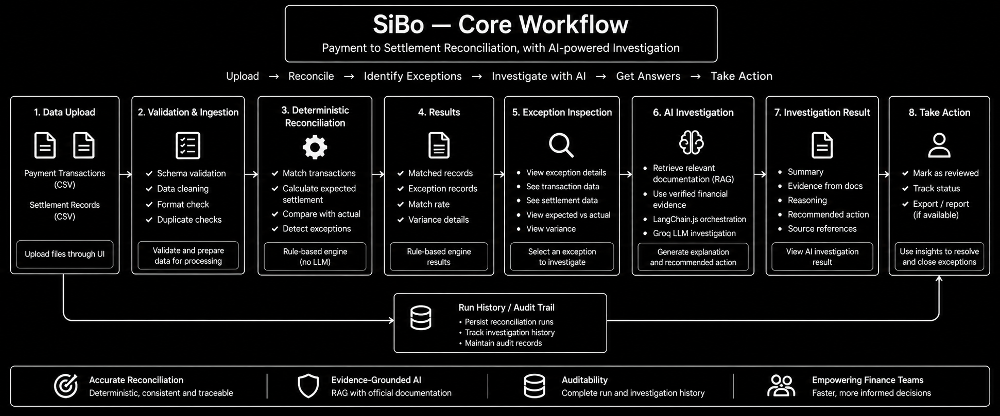
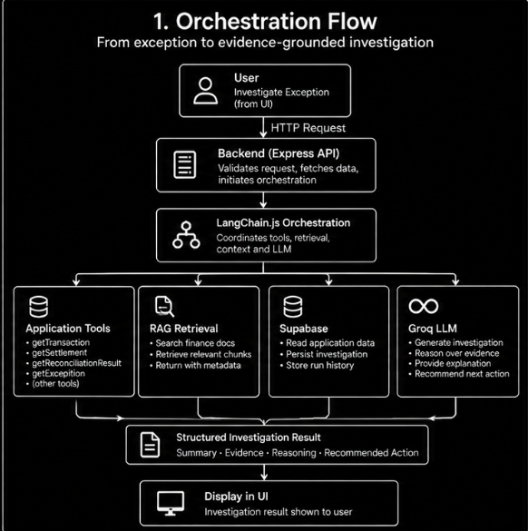
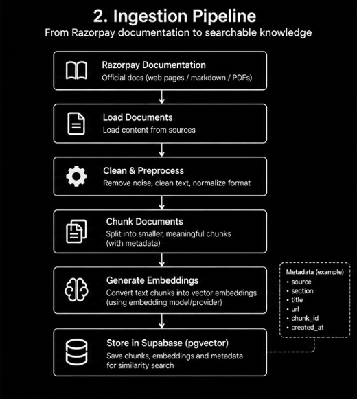
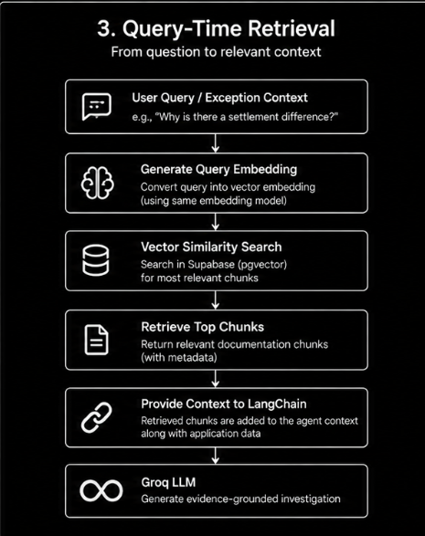
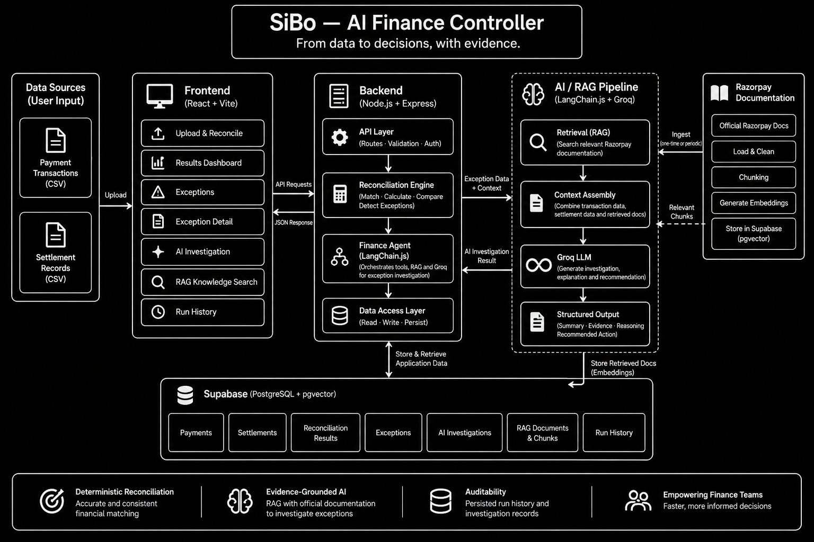

# SiBo — AI Controller

SiBo focuses on one specific finance-operations loop:
**Payment → Settlement → Reconciliation → Exception → AI Investigation**

SiBo processes payment and settlement data through a complete reconciliation workflow where deterministic financial calculations are handled by a rules-based engine, and AI-powered investigation is used exclusively for explaining exceptions after they are detected.

## Overview


SiBo (AI Finance Controller) is an autonomous payment settlement reconciliation and AI exception investigation engine. It combines deterministic financial logic with AI-powered investigation to reconcile payment and settlement records, detect mismatches, and explain exceptions using official Razorpay documentation.

The system validates and ingests payment and settlement data, runs deterministic reconciliation to identify matches and exceptions, then uses AI investigation (powered by LangChain.js orchestration, Groq LLM, and RAG retrieval) to provide grounded explanations for discrepancies.

## Problem

Finance operations teams face significant challenges in payment reconciliation:
- Payment records and settlement records frequently differ due to fees, taxes, adjustments, or processing delays
- Manual reconciliation is time-consuming and error-prone
- Exception investigation requires digging through documentation and transaction details
- Finance teams need evidence-based explanations, not just AI-generated guesses
- Traditional approaches either rely entirely on manual review or black-box AI that cannot be audited

## Solution

SiBo's approach deliberately separates concerns:
1. **Deterministic Reconciliation Engine** - Handles all financial calculations using explicit, auditable rules
2. **AI-Powered Investigation** - Explains *why* exceptions occurred using verified data and retrieved documentation
3. **Retrieval-Augmented Generation (RAG)** - Grounds AI responses in official Razorpay documentation
4. **Persistent Audit Trail** - All results stored in Supabase for compliance and review

This separation ensures financial integrity while providing intelligent assistance for exception resolution.

## Core Workflow



**Deterministic Reconciliation Responsibilities:**
- Validating input records
- Identifying transaction IDs
- Finding corresponding settlement records
- Detecting duplicates
- Calculating expected settlement using: `expectedSettlement = paymentAmount - fee - tax - refund + adjustment`
- Comparing expected vs actual settlement
- Classifying results (MATCHED, AMOUNT_MISMATCH, COMPONENT_MISMATCH, MISSING_SETTLEMENT, DUPLICATE_TRANSACTION, UNEXPLAINED_DIFFERENCE)
- Creating exception records with evidence trails

**AI Investigation Responsibilities (Post-Reconciliation):**
- Inspecting verified reconciliation evidence
- Retrieving relevant transaction/settlement data through tools
- Retrieving relevant authoritative documentation through RAG
- Reasoning over available evidence
- Explaining discrepancies when supported by evidence
- Recommending next actions
- Clearly identifying uncertainty
- Returning structured output with source citations
- **Never** overriding deterministic reconciliation results

## Key Features

✅ **CSV Ingestion** - Upload payment and settlement datasets via drag-and-drop interface
✅ **Schema Validation** - Validates required fields and data types before processing
✅ **Deterministic Reconciliation Engine** - Rule-based financial matching with explicit formulas
✅ **Exception Classification** - Automatically categorizes mismatches into 6 exception types
✅ **Exception Inspection** - Detailed views showing payment/settlement breakdown and variance
✅ **AI Investigation** - LangChain.js orchestrated Groq analysis with RAG retrieval
✅ **RAG Knowledge Search** - Semantic search over official Razorpay settlement documentation
✅ **Razorpay Documentation Grounding** - AI explanations cite authoritative sources
✅ **Supabase Persistence** - All data stored in PostgreSQL with pgvector for embeddings
✅ **Run History** - Audit log of all reconciliation executions
✅ **Authentication** - Not implemented (not required by specification)
✅ **Frontend Workflow** - Complete 6-page React/Vite application with responsive design

## Reconciliation Engine

SiBo's deterministic reconciliation engine implements the following logic:

**Synthetic Reconciliation Formula:**
```
expectedSettlement = paymentAmount - fee - tax - refund + adjustment
```

**Process Flow:**
1. **Validate Records** - Check required fields and data formats
2. **Match Transactions** - Find settlement records by transaction ID
3. **Detect Duplicates** - Flag duplicate transaction IDs
4. **Calculate Expected** - Apply synthetic formula using payment and settlement components
5. **Compare Actual** - Compare expected vs actual settlement amount
6. **Classify Result** - Categorize as:
   - **MATCHED** - Expected equals actual within tolerance
   - **AMOUNT_MISMATCH** - Total amounts differ
   - **COMPONENT_MISMATCH** - Fee/tax/adjustment/refund components differ
   - **MISSING_SETTLEMENT** - No settlement record found for payment
   - **DUPLICATE_TRANSACTION** - Duplicate payment transaction ID detected
   - **UNEXPLAINED_DIFFERENCE** - Difference cannot be attributed to known components

**Evidence Tracking:** The engine records intermediate values (fee, tax, refund, adjustment) and calculation steps for AI investigation review.

## Exception Types

SiBo detects and categorizes the following exception types based on actual backend implementation:

- **MATCHED** - Payment and settlement reconcile successfully
- **AMOUNT_MISMATCH** - Total settlement amount differs from expected
- **COMPONENT_MISMATCH** - Individual components (fee, tax, adjustment, refund) differ
- **MISSING_SETTLEMENT** - Payment record has no corresponding settlement
- **DUPLICATE_TRANSACTION** - Duplicate payment transaction ID detected
- **UNEXPLAINED_DIFFERENCE** - Variance not attributable to known financial components

Each exception includes detailed evidence: expected vs actual amounts, component breakdowns, and transaction metadata.

## AI Investigation

When an exception is selected for investigation:

1. **Evidence Collection** - Loads transaction, settlement, and reconciliation evidence
2. **Knowledge Retrieval** - Searches Razorpay documentation via RAG for relevant rules
3. **Context Assembly** - Combines verified data with retrieved documentation
4. **LLM Analysis** - Groq model analyzes evidence + documentation via LangChain.js
5. **Structured Response** - Returns investigation with explanation, sources, and recommendation
6. **Persistence** - Saves investigation results to Supabase
7. **Display** - Shows grounded explanation with source citations to user

**What the AI Does:**
- Analyzes verified transaction/settlement evidence
- Retrieves and cites official Razorpay documentation
- Explains discrepancies when supported by evidence
- Recommends finance operations actions
- Clearly states when evidence is insufficient (UNRESOLVED)
- Provides confidence scoring for investigations

**What the AI Does NOT Do:**
- Override deterministic reconciliation calculations
- Invent transaction or settlement records
- Fabricate fees, taxes, or adjustments
- Provide legal/tax advice beyond retrieved sources
- Claim resolution without evidence

## Why LangChain.js / Orchestration?

SiBo uses LangChain.js as an orchestration layer rather than direct LLM API calls for critical architectural reasons:

**Problem with Direct LLM Calls:**
A direct/general LLM API call receives only an exception description and must:
- Infer transaction details from limited context
- Potentially hallucinate financial data
- Lack access to verified application data
- Have no mechanism to enforce deterministic boundaries
- Risk providing unsupported explanations

**SiBo's Orchestrated Approach:**
LangChain.js enables structured, verifiable AI investigation by:
1. **Tool-Mediated Data Access** - AI can only retrieve data through predefined, validated tools
2. **Controlled Context** - Only verified application data and retrieved documentation reach the LLM
3. **Deterministic Boundaries** - Reconciliation results are treated as ground truth, not suggestions
4. **Retrieval-Grounded Generation** - RAG ensures explanations are tied to authoritative sources
5. **Structured Output Validation** - Responses are validated against expected schema before return
6. **Audit Trail** - Every tool call and retrieval is logged for compliance

**Orchestration Flow:**




This ensures AI investigations are:
- **Grounded** in actual transaction data
- **Verifiable** through source citations
- **Compliant** with financial control requirements
- **Explainable** showing exactly what evidence was used
- **Safe** from overriding deterministic financial logic

## How RAG Works in SiBo

### Ingestion Pipeline




### Query-Time Retrieval




**Key RAG Characteristics:**
- **Retrieval, Not Fine-Tuning** - Documentation is indexed at runtime; model weights unchanged
- **Source Attribution** - Every retrieved chunk preserves metadata for citation
- **Real-Time Updates** - Adding new documents immediately available (no retraining)
- **Grounded Responses** - AI explanations must cite retrieved sources
- **Fallback Handling** - Automatic switch to backup embedding model if primary unavailable

**Why This Matters:**
Without RAG, an LLM might rely on general knowledge or invent explanations. With RAG, SiBo grounds investigations in the specific, authoritative Razorpay documentation available to the application, ensuring explanations are accurate, verifiable, and compliant.

## Architecture



SiBo follows a clean separation of concerns architecture:

**Frontend Layer (React/Vite):**
- Responsible for presentation and user interaction
- 6 dynamic pages connected to live APIs
- No hardcoded metrics or fake data
- Responsive design with premium fintech aesthetic
- Human-readable labels for technical enums

**Backend Layer (Express.js/Node.js):**
- API boundaries, security, validation, and service orchestration
- Deterministic reconciliation engine (pure JavaScript)
- LangChain.js AI agent with 5 specialized tools
- RAG pipeline with pgvector similarity search
- Groq LLM for reasoning/generation
- Centralized error handling and logging

**Data Layer (Supabase):**
- **PostgreSQL** - Structured financial/application data:
  - payment_records, settlement_records
  - reconciliation_runs, reconciliation_results
  - exceptions, ai_investigations
- **pgvector** - Semantic knowledge storage:
  - rag_documents (6 Razorpay source files)
  - rag_chunks (54 text chunks with embeddings)
  - Vector similarity search via match_rag_chunks() function

**Clear Separation:**
- Financial calculations → Deterministic engine (no AI)
- Knowledge retrieval → RAG pipeline (no fine-tuning)
- AI reasoning → LangChain + Groq (no data modification)
- Presentation → React frontend (no business logic)

## Technology Stack

**Frontend:**
- React 18.3.1 - Modern UI library
- Vite 6.1.0 - Build tool and dev server
- React Router DOM 7.1.5 - Client-side routing
- Recharts 2.15.1 - Data visualization
- Lucide React 0.475.0 - Icon library
- React Markdown 10.1.0 - Markdown rendering
- Axios 1.7.9 - HTTP client

**Backend:**
- Node.js - JavaScript runtime
- Express.js 4.21.2 - Web framework
- LangChain.js 0.3.15 - AI orchestration
- @langchain/groq 0.1.3 - Groq integration
- @langchain/core 0.3.40 - Core LangChain abstractions
- @langchain/community 0.3.30 - Community integrations
- @supabase/supabase-js 2.48.1 - Supabase client
- Hugging Face Inference 3.3.4 - Embedding generation
- CORS 2.8.5 - Middleware
- CSV Parse 5.6.0 - CSV processing
- Multer 1.4.5 - File upload handling
- Zod 3.24.2 - Request validation
- Dotenv 16.4.7 - Environment configuration
- PG 8.23.0 - PostgreSQL client

**AI/ML Components:**
- Groq LLM - openai/gpt-oss-120b (reasoning/generation)
- Embedding Model - Qwen/Qwen3-Embedding-0.6B (1024d) with automatic fallback to BAAI/bge-large-en-v1.5
- Vector Store - Supabase pgvector (similarity search)

**Infrastructure:**
- Supabase - Managed PostgreSQL + pgvector
- Environment Variables - Secure configuration management

## Project Structure

```
SiBo/
├── backend/
│   ├── src/
│   │   ├── config/           # Configuration (Supabase, env)
│   │   ├── controllers/      # Request handlers
│   │   ├── middleware/       # Error handling, validation
│   │   ├── routes/           # API endpoint definitions
│   │   ├── services/         # Business logic (CSV, reconciliation)
│   │   ├── agent/            # LangChain agent and tools
│   │   ├── rag/              # RAG pipeline (loaders, splitters, embeddings, retriever)
│   │   └── server.js         # Express entry point
│   ├── package.json          # Backend dependencies
│   └── .env.example          # Environment variable template
├── frontend/
│   ├── src/
│   │   ├── components/       # Reusable UI components
│   │   │   ├── DashboardView.jsx
│   │   │   ├── LandingHero.jsx
│   │   │   ├── ReconcileView.jsx
│   │   │   ├── ResultsView.jsx
│   │   │   ├── ExceptionsView.jsx
│   │   │   ├── ExceptionDetailView.jsx
│   │   │   ├── KnowledgeView.jsx
│   │   │   └── HistoryView.jsx
│   │   ├── pages/            # Page components
│   │   ├── utils/            # Formatters, helpers
│   │   ├── App.jsx           # Root component with routing
│   │   ├── main.jsx          # Vite entry point
│   │   └── index.css         # Design system (pale blue + black line-art)
│   ├── package.json          # Frontend dependencies
│   └── vite.config.js        # Vite configuration
├── rag/
│   └── sources/              # 6 Razorpay documentation files
│       ├── 01-about-settlements.md
│       ├── 02-settlement-breakup.md
│       ├── 03-settlement-apis.md
│       ├── 04-settlement-api-reference.md
│       ├── 05-settlement-faqs.md
│       └── 06-settlement-details.md
├── data/
│   └── synthetic/            # Synthetic dataset generation
│       └── generateSyntheticData.js
├── src/
│   └── scripts/
│       └── verify_phase8_e2e.js  # End-to-end verification script
├── .gitignore
├── .env.example              # Root environment template
└── README.md                 # This file
```

## Prerequisites

- Node.js 18+ (tested with v20.x)
- npm 9+ (comes with Node.js)
- Supabase account and project
- Groq API key
- Hugging Face API key (for embeddings) - optional due to automatic fallback

## Installation

**Recommended Setup Flow:**
```bash
# 1. FIRST create a project folder
mkdir SiBo
cd SiBo

# 2. THEN clone the repository into that folder
git clone https://github.com/kachamsiddarth/SiBo .

# 3. Install backend dependencies
cd backend
npm install

# 4. Install frontend dependencies
cd ../frontend
npm install
```

## Environment Setup

Create environment files based on the examples:

**Backend (.env):**
```
PORT=5000
SUPABASE_URL=your_supabase_project_url
SUPABASE_ANON_KEY=your_supabase_anon_key
SUPABASE_SERVICE_ROLE_KEY=your_supabase_service_role_key
GROQ_API_KEY=your_groq_api_key
GROQ_MODEL=openai/gpt-oss-120b
HF_TOKEN=your_huggingface_token  # Optional - automatic fallback available
HF_EMBEDDING_MODEL=Qwen/Qwen3-Embedding-0.6B
```

**Frontend (.env):**
```
VITE_API_BASE_URL=http://localhost:5000
```

**Important Security Notes:**
- Never commit `.env` files containing secrets
- Never expose backend-only API keys (SUPABASE_SERVICE_ROLE_KEY, GROQ_API_KEY) in frontend
- Never expose Supabase secret/service-role credentials to browser
- Groq credentials must remain server-side only
- Embedding provider credentials must remain server-side

## Running the Application

**Start Backend Server:**
```bash
cd backend
npm run dev  # Uses --watch for auto-restart
```
Backend will be available at http://localhost:5000

**Start Frontend Server:**
```bash
cd frontend
npm run dev  # Vite dev server
```
Frontend will be available at http://localhost:5173

**Health Check:**
Verify backend is running: http://localhost:5000/api/health

## Using SiBo

**Complete Workflow:**
1. **Start Application** - Ensure both backend and frontend servers are running
2. **Navigate to Upload & Reconcile** - Go to http://localhost:5173/reconcile
3. **Upload Payment Data** - Select or drag payment CSV file
4. **Upload Settlement Data** - Select or drag settlement CSV file
5. **Validate Dataset** - Click validate to check data integrity
6. **Start Reconciliation** - Click run reconciliation to process data
7. **View Results** - Navigate to Results page to see matched/exception records
8. **Inspect Exceptions** - Go to Exceptions page to review mismatches
9. **Investigate with AI** - Open an exception detail and click "Investigate with AI"
10. **Review Investigation** - View AI explanation with source citations and recommendations
11. **Check Run History** - View historical reconciliation runs in History page

## API / Backend Overview

**Key Endpoints:**
- `GET /api/health` - Backend and service connectivity check
- `POST /api/upload` - File upload and validation (CSV processing)
- `POST /api/reconciliation/run/:id` - Trigger reconciliation for upload session
- `GET /api/reconciliation/results/:runId` - Get reconciliation results for run
- `GET /api/exceptions` - List all exceptions with filtering
- `GET /api/exceptions/:exceptionId` - Get specific exception details
- `POST /api/ai/investigate/:exceptionId` - Trigger AI investigation for exception
- `GET /api/ai/investigations/:id` - Get AI investigation results
- `GET /api/rag/search` - RAG knowledge base search endpoint
- `GET /api/dashboard/summary` - Get dashboard metrics (totals, match rate, etc.)

## Data Model

**Core Supabase Tables:**
- `payment_records` - Payment transaction data (amount, method, status, etc.)
- `settlement_records` - Settlement transaction data (fee, tax, adjustment, refund, etc.)
- `reconciliation_runs` - Metadata for each reconciliation batch (timestamps, counts)
- `reconciliation_results` - Match/exception results per transaction (expected/actual amounts, variance)
- `exceptions` - Unresolved mismatches requiring investigation (type, severity, evidence)
- `ai_investigations` - LLM-generated explanations with sources, confidence, reasoning
- `rag_documents` - Document metadata for 6 Razorpay source files
- `rag_chunks` - Text chunks with 1024d embeddings for vector search

## Synthetic Dataset

SiBo uses synthetically generated finance data for demonstration and testing:
- **Deterministically Generated** - Reproducible dataset with seed values
- **Realistic Scenarios** - Includes all 6 exception types in realistic proportions
- **Clearly Labeled** - All data marked as synthetic, not production Razorpay data
- **Configurable Size** - Default 60 records (adjustable for testing)
- **Purpose-Built** - Designed to test exception detection and AI investigation capabilities

**Important:** Synthetic fields and data should NOT be represented as official Razorpay production data. They are exclusively for demonstrating the reconciliation workflow.

## Security

SiBo implements the following security measures:
- **Server-Side Secrets** - All API keys and credentials stored in backend environment only
- **Environment Variable Isolation** - Frontend receives no sensitive backend credentials
- **Input Validation** - Zod schema validation on all API endpoints
- **File Upload Security** - Multer with file type/size limits
- **Error Handling** - Centralized error handler prevents stack trace leakage
- **Role-Based Access** - Supabase Row Level Security ready (not enabled as auth not implemented)
- **Secure Defaults** - No hardcoded credentials, safe error messages
- **Audit Logging** - Structured logging for compliance (no sensitive data)

## Testing

SiBo includes verification scripts for critical logic:

**End-to-End Verification:**
- `src/scripts/verify_phase8_e2e.js` - Complete workflow test
- Tests: dataset generation, upload, validation, reconciliation, exception detection, AI investigation, persistence
- **Latest Results:** 15/16 tests passed (93.75%) - minor API format difference in RAG endpoint (functionally working)

**Manual Testing Available Through UI:**
- Upload synthetic datasets via Reconcile page
- Run reconciliation and verify results
- Test AI investigation on detected exceptions
- Verify RAG search via Knowledge Base page
- Check dashboard metrics update with real data


## Limitations

Based on actual implementation:

- **Synthetic Data** - Uses generated finance data rather than production Razorpay datasets
- **Application-Specific Rules** - Implements synthetic reconciliation formula, not universal accounting standard
- **AI Explanation Dependencies** - AI explanations depend on retrieved evidence and documentation quality
- **Not an Accounting System** - Designed for demonstration and investigation, not production bookkeeping
- **Not a Replacement for Human Review** - AI provides explanations; final decisions require human judgment
- **No Authentication** - Currently runs without user authentication (not required by spec)
- **Limited Exception Types** - Covers 6 common mismatch scenarios but not all possible financial discrepancies
- **Single Tenant** - Designed for single-user demonstration scenarios

## Future Improvements

Clearly labeled as future work - not currently implemented:

- **Authentication System** - Add user authentication and role-based access control
- **Production Data Connectors** - Integrate with actual Razorpay APIs for live data
- **Advanced Exception Types** - Expand detection to include more complex financial scenarios
- **Enhanced AI Capabilities** - Add multi-step reasoning, confidence calibration, uncertainty quantification
- **Batch Investigation** - Enable AI investigation of multiple exceptions simultaneously
- **Export Functionality** - PDF/CSV export of reports and investigations
- **Notification System** - Email alerts for high-priority exceptions
- **Advanced Analytics** - Trend analysis, exception pattern detection, predictive insights
- **Multi-Language Support** - Internationalization for global deployment
- **Performance Optimization** - Bundle analysis, lazy loading, caching strategies
- **Accessibility Enhancements** - Full WCAG 2.1 AA compliance audit and improvements
- **End-to-End Testing** - Cypress test suite for critical user journeys
- **Deployment Automation** - Docker configuration, CI/CD pipelines, monitoring setup

## Documentation


> Detailed technical documentation covering the system design, implementation decisions, API behavior, reconciliation logic, RAG pipeline, AI orchestration, testing, limitations, and development journey will be linked here.

    https://docs.google.com/document/d/1L1pHVx3u_TT0XA97x5VuP8Rya-TiUebN/edit


